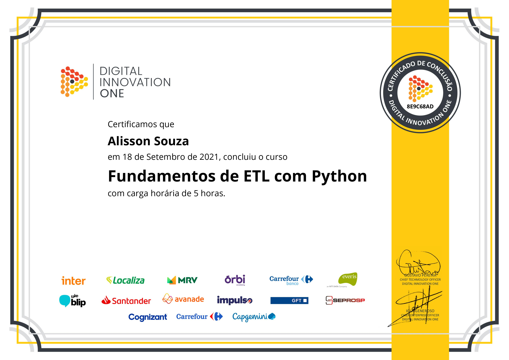

# ETL - Extract, transform, load

## O que é ETL

É composto por 3 etapas. Extração, Transformação e carregamento

- Extract: Permite que is dados sejam extraídos de diferentes fontes. Bases de dados, arquivos, APIs, podem ser processadas em lote, tempo real. Como esses dados podem existir e ser extraídos de forma inconsistente. Devemos garantir a integridade do dado que será passado para dentro do contexto. que é feito na etapa de transformação.
- Transform: Propagados para a área de preparação de dados,o nde são transformados e limpos.
- Load: Carregados no data warehouse.

## ---

- Data sources: Diferentes fontes de dados
- Data Flow / Pipeline
  - Data validation
  - Data cleaning
  - Data Transforming
  - Data agregation
  - Data Loading

## Ferramentas e Pacotes

Principais ferramentas no utlizidads mercado para a linguagem python

- Apache Airflow: Concebido pelos engenheiros do AirBnb. Gerenciamento de workflows que seria possível intervir programando
- Luigi: Pacote contruido pelo spotify, e permite a contrução de visializacao e extraçao de falhas com maior facilidade
- bonobo:kit de ferramentas para trabalhar com etl em python de forma rápida. Executar processos em paralelo e extrai de varias fontes csv, json etc
- Bubbles: Processar, auditar e inspecionar dados. compreensao e transparencia do processo do etl
- petl: uso e contrução de etl em geral, mas não foi projetado para uso de muita memória
- pandas: pode ser utilizado com maior fonte de dados.

## Objetivo do Projeto

Dados utilizados no projeto - cenipa
Extrair os dados do arquivo ocorrencias.csv, validar, limpar, transformar e gerar novas informações a partir desses dados
